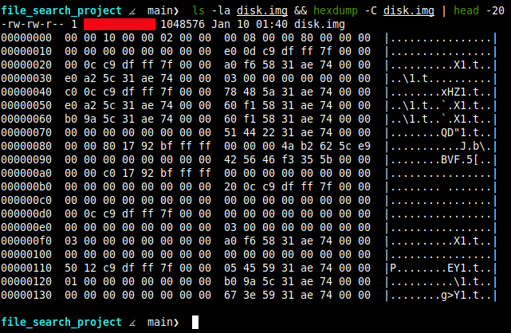
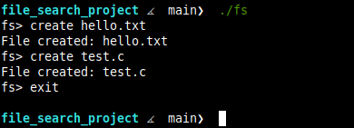
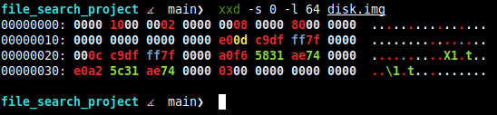
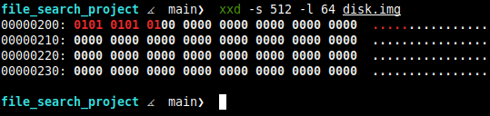
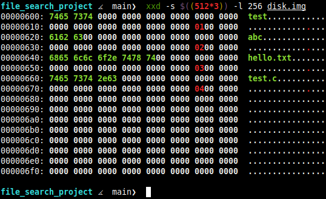

# Sistem File i Thjeshte

Nje sistem file i thjeshte qe krijon operacionet e diskut ne gjuhen C, duke perdorur një imazh **virtual disk**.

## Ne pamje te pare

Ky projekt krijon nje *virtual disk* ('disk.img') me madhesi 1MB, me nje strukture file-sh te thjeshte:   

| Blloku | Qellimi |
|-------|---------|
| 0 | Superblock |
| 1 | Inode Bitmap |
| 2 | Inode Table |
| 3 | Root Directory |

## Screenshote

**Struktura e file-ve te Sistemit**


**Terminal Interaktiv**


**Superblock**


**Ndryshimet i inode bitmap**


**Hyrjet ne Direktory**


## Specifikimet

- **Disk Size:** 1 MB
- **Block Size:** 512 bite
- **Max Inodes:** 128
- **Max Filename:** 28 karaktere

## Files

- `fs.h` - Struktura e te dhennave dhe definicionet
- `fs.c` - Implementimi i sistemit te file-ve
- `main.c` - Terminal Interaktiv

## Perdorimi

```bash
gcc -o fs main.c fs.c
./fs

fs> create emerfile
File created: emerfile
fs> exit
```

## Komandat

| Komanda | Pershkrimi |
| ------- | ---------- |
| `create <emerfile>` | Krijon nje file te ri |
| `exit` | Del nga programi |